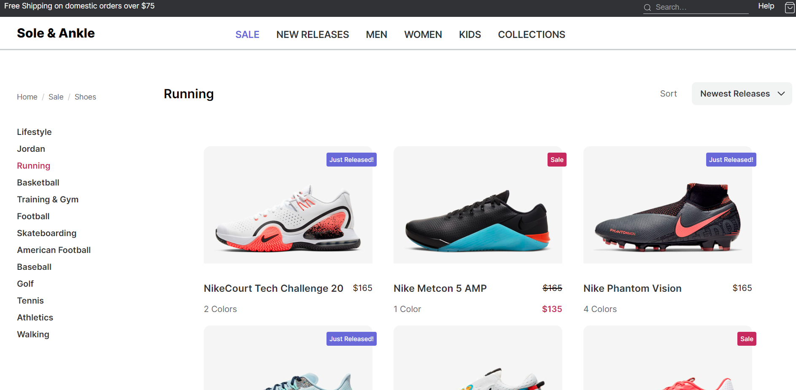

# README

# About

1. Implementation of an ideal E-commerce products page
2. Built using Vite, and React library
3. CSS Library - Styled components

# Demo

# Running locally

1. Install node.js
2. Run npm install or yarn
3. Run the dev server using npm run dev or yarn dev
4. Runns at localhost:5173

